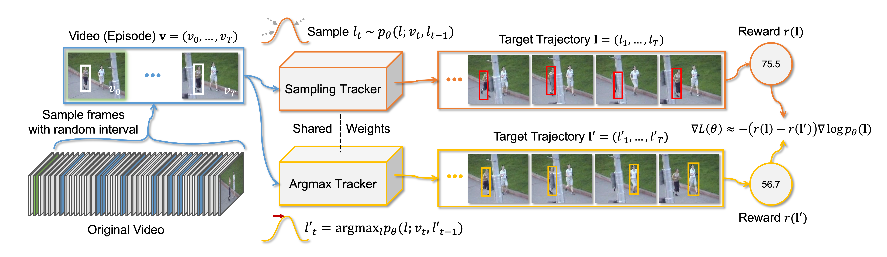
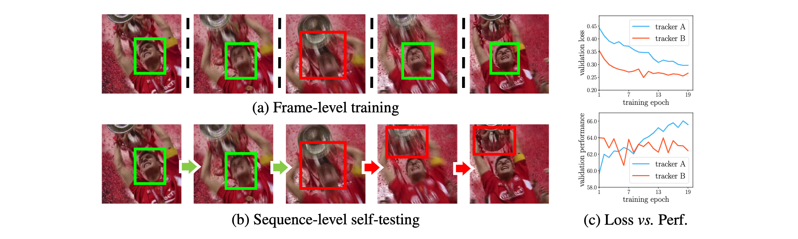
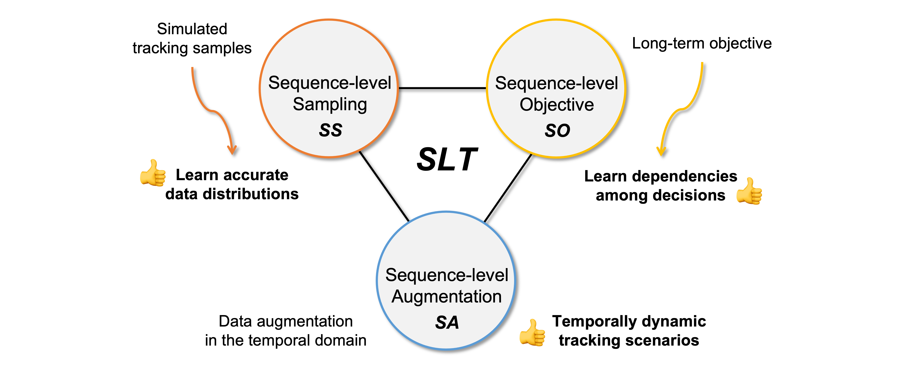

# SLTtrack

Official implementation of the ECCV 2022 paper **Towards Sequence-Level Training for Visual Tracking** \
Minji Kim*, Seungkwan Lee*, Jungseul Ok, Bohyung Han, Minsu Cho (_* denotes equal contribution_)

[**[Paper]**](https://arxiv.org/pdf/2208.05810.pdf)
[**[Models]**](https://drive.google.com/drive/folders/1gv7dIw6ywS47pjBkDWUrtWjdpjieyD6O?usp=sharing)
[**[Raw Results]**](https://drive.google.com/drive/folders/1gplZ_HCeLeK0ouHUKrSsDPyB9r0ReDxl?usp=sharing)




## Introduction
### :exclamation: Problem: training-testing inconsistency in recent trackers

**Pitfall of frame-level training for visual tracking:** \
Training a tracker to better localize a target in each of individual frames of (a) 
does not necessarily improve actual tracking in the sequence of (b).
Due to this issue, inconsistency between the validation loss and the validation performance is often observed during training as shown in (c).
<br/>


### :sparkles: Solution: Sequence-Level Training (SLT)

Based on a reinforcement learning framework, SLT trains a model by actually tracking on a video and directly optimizing a tracking performance metric.
Our sequence-level design of data sampling, learning objective, data augmentation boosts the generalization performance for visual tracking.
<br/>


### :sparkles: Result: improvements on four baselines without modifying model architectures

|     Tracker (Base → Ours)     |      LaSOT (AUC)       |   TrackingNet (AUC)    |      GOT-10K (AO)       |
|:-----------------------------:|:----------------------:|:----------------------:|:-----------------------:|
| SiamRPN++ → **SLT-SiamRPN++** | 51.0 → **58.4** (+7.4) | 68.2 → **75.8** (+7.6) | 49.5 → **62.1** (+12.6) |
|  SiamAttn → **SLT-SiamAttn**  | 54.8 → **57.4** (+2.6) | 74.3 → **76.9** (+2.6) | 53.4 → **62.5** (+9.1)  |
|    TrDiMP → **SLT-TrDiMP**    | 63.3 → **64.4** (+1.1) | 78.1 → **78.1** (+0.0) | 67.1 → **67.5** (+0.4)  |
|    TransT → **SLT-TransT**    | 64.2 → **66.8** (+2.6) | 81.1 → **82.8** (+1.7) | 66.2 → **67.5** (+1.3)  |

<br/>

## Getting Started

### Installation

We tested the codes in the following environments but other versions may also be compatible.
* CUDA 11.3
* Python 3.9
* PyTorch 1.10.1
* Torchvision 0.11.2

```
# Create and activate a conda environment
conda create -y --name slt python=3.9
conda activate slt

# Install PyTorch
conda install pytorch==1.10.1 torchvision==0.11.2 cudatoolkit=11.3 -c pytorch -c conda-forge

# Install requirements
pip install -r requirements.txt
sudo apt-get install libturbojpeg

# Build pycocotools
cd ${SLTtrack_ROOT}/pysot_toolkit
python setup.py build_ext --inplace

# Build library for deformable convolution/pooling
cd ${SLTtrack_ROOT}/pysot_toolkit/pysot/models/head/dcn
python setup.py build_ext --inplace
```

### Training & Testing

* **SLT-TransT** and **SLT-TrDiMP** are implemented based on **PyTracking** library. \
Please refer to [tutorial_pytracking.md](assets/tutorial_pytracking.md) for more details.

* **SLT-SiamRPN++** and **SLT-SiamAttn** are implemented based on **PySOT** library. \
Please refer to [tutorial_pysot.md](assets/tutorial_pysot.md) for more details.
  
### Models and Raw Results
Models and raw tracking results are provided in [**[Models]**](https://drive.google.com/drive/folders/1gv7dIw6ywS47pjBkDWUrtWjdpjieyD6O?usp=sharing) 
[**[Raw Results]**](https://drive.google.com/drive/folders/1gplZ_HCeLeK0ouHUKrSsDPyB9r0ReDxl?usp=sharing).


## Citation
If you find SLT useful in your research, please consider citing our paper:
```bibtex
@inproceedings{SLTtrack,
  title={Towards Sequence-Level Training for Visual Tracking},
  author={Kim, Minji and Lee, Seungkwan and Ok, Jungseul and Han, Bohyung and Cho, Minsu},
  booktitle={ECCV},
  year={2022}
}
```

## Acknowledgments
SLTtrack is developed upon [PyTracking](https://github.com/visionml/pytracking) library and [PySOT](https://github.com/STVIR/pysot) library,
also borrowing from [TransT](https://github.com/chenxin-dlut/TransT), [TrDiMP](https://github.com/594422814/TransformerTrack),
[SiamAttn](https://github.com/msight-tech/research-siamattn).
We would like to thank the authors for providing great frameworks and toolkits.


## Contact
Minji Kim: minji@snu.ac.kr \
Seungkwan Lee: seungkwan@postech.ac.kr
